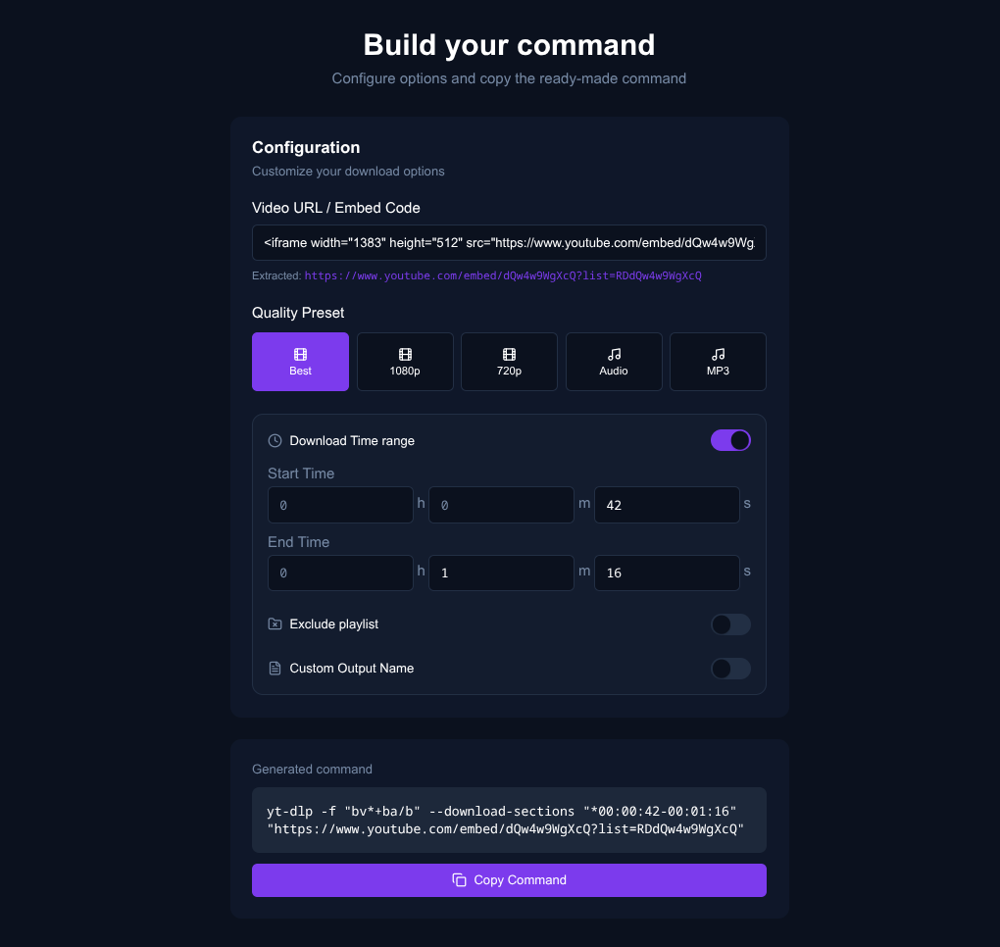

# yt-dlp command generator

## Overview

This is a simple tool to generate some common yt-dlp commands more easily.

Try it out here: https://leoncik.github.io/yt-dlp-command-generator/

## Main features

- Automatically removes HTML tags from copied URLs for easier command generation.
- Quality preset selection.
- Audio download option.
- Specify start and end times in a human-friendly format (e.g., `00:01:30-00:03:45`) without manually converting to milliseconds.
- Custom output name option.

## Make it yours!

This tool is just an HTML file: you can copy it to your desktop and modify it according to your needs. If you prefer, know that this generator is also available as a PWA.

## Similar projects

Other projects more complex than this one have been made to simplify the process of generating yt-dlp commands. I highly recommend [this one](https://toolbrew.org/), made by [Vishal Kaleria](https://github.com/VishalKaleria).
